# WiFi_LoRa_32_V3 在Arduino IDE上的编译和上传

本教程目的是展示如何通过Arduino IDE对 WiFi_LoRa_32_V3 LoRa模块 进行编程和上传。

## 先决条件
- 电脑上已经装有Arduino IDE
如果还未安装，请在Arduino官网链接进行Arduino IDE下载安装：[https://www.arduino.cc/en/software](https://www.arduino.cc/en/software)
**注：本教程使用的是旧版本 1.8.19，并不推荐使用2.0及以上版本，这两个版本差异较大，可能会出现执行异常的情况。**

## 注意
V3系列开发环境已经集成了示例代码，并将其添加到开发环境中，而不需要额外的下载库。最新版本已经处理了示例代码的兼容性，以便该代码可以用于各种版本的ESP32开发板，使用新的开发环境时，旧版本的库将无法再使用，例如ESP32_LoRaWAN、Heltec_ESP32。
本教程使用新的开发环境，建议您删除旧的开发环境、下载新的开发环境和删除旧版本的库。
* 对于Git，它已于2022年9月19日更新到V3系列开发环境。
* 对于“Arduino Board Manager”，V0.0.7及以上是V3系列开发环境。
如果您在旧的开发环境中修改了大量代码并在项目中使用，我们建议您仍然使用旧的发展环境。

# 1. 安装WiFi_LoRa_32_V3 开发环境
本教程建议使用官网下载的离线包进行安装，通过git、Arduino Board Manager操作时存在文件不全的情况。
后续新版本可能会有所改善。

## 1.1 通过Arduino Board Manager安装开发环境
要在Arduino IDE中安装**WiFi_LoRa_32_V3**开发环境，请按照如下步骤进行操作

1. 在Arduino IDE中，转到 **File** >  **Preferences**  
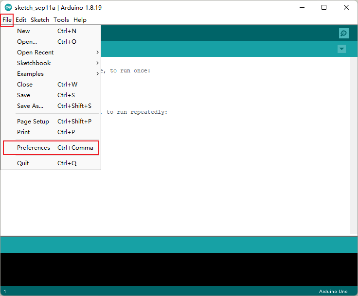

2. 输入最新的WiFi_LoRa_32_V3 LoRa开发环境包地址：
>https://github.com/Heltec-Aaron-Lee/WiFi_Kit_series/releases/download/0.0.8/package_heltec_esp32_index.json

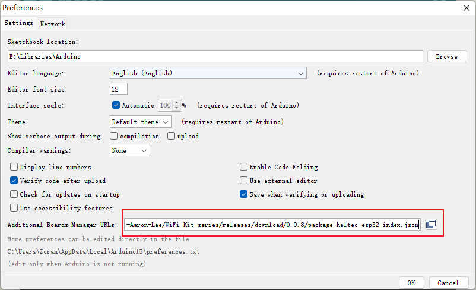

3. 单击工具-->Board-->Board Manager。

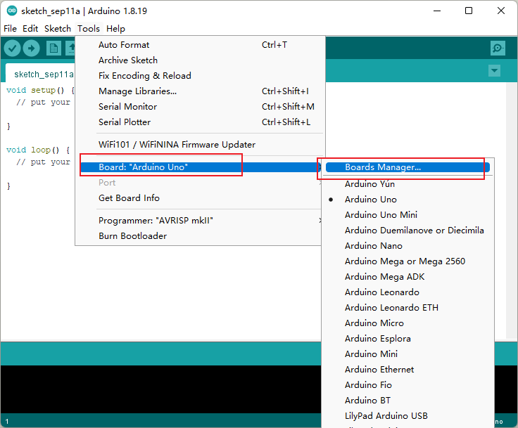

4. 在新的弹出对话框中搜索 **Heltec ESP32**，然后选择最新版本并单击安装

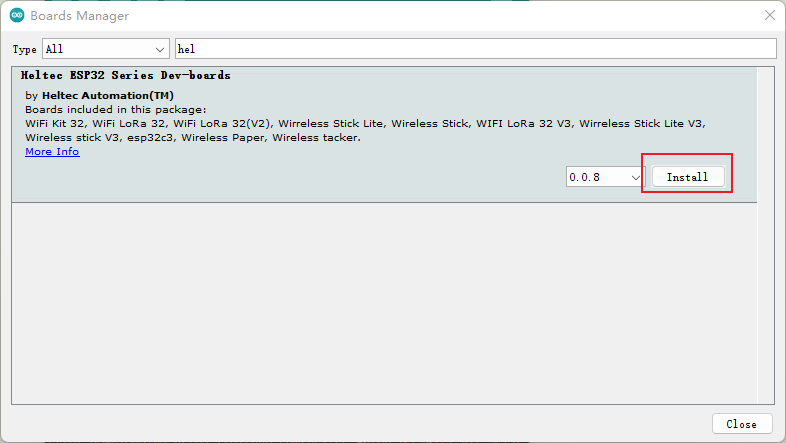

5. 显示安装成功

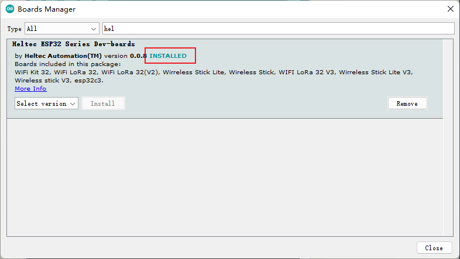

注：此方法安装受限于网络问题，会多次中断或者下载缓慢，以上问题需要更好网络或者多次下载

## 1.2 通过官网下载或者Github下载离线安装包

官网离线安装包：[WiFi_Kit_series.zip](https://resource.heltec.cn/download/tools/WiFi_Kit_series.zip)（推荐）
Github离线安装包：[WiFi_Kit_series](https://github.com/Heltec-Aaron-Lee/WiFi_Kit_series)

## 1.3 通过离线安装包进行安装

1. 在Arduino IDE中，转到 **File** >  **Preferences**  
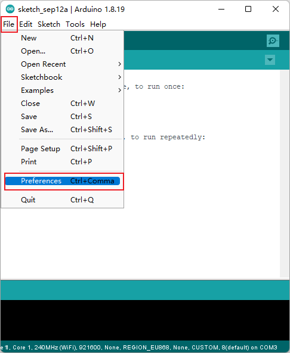

2. 转到红色框中所指向的文件夹 

3. 在此文件夹中创建一个新的“hardware”文件夹。如果已经有一个“hardware”文件夹，则无需创建新文件夹。

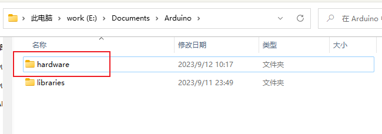

4. 转到“hardware”文件夹并将“WiFi_Kit_series”解压到此文件夹中。

5. 重新启动Arduino IDE以确认开发环境是否安装成功。
    如图红框中带 in sketchbook代表离线安装成功，不带的代表通过Arduino IDE Board Manager安装。
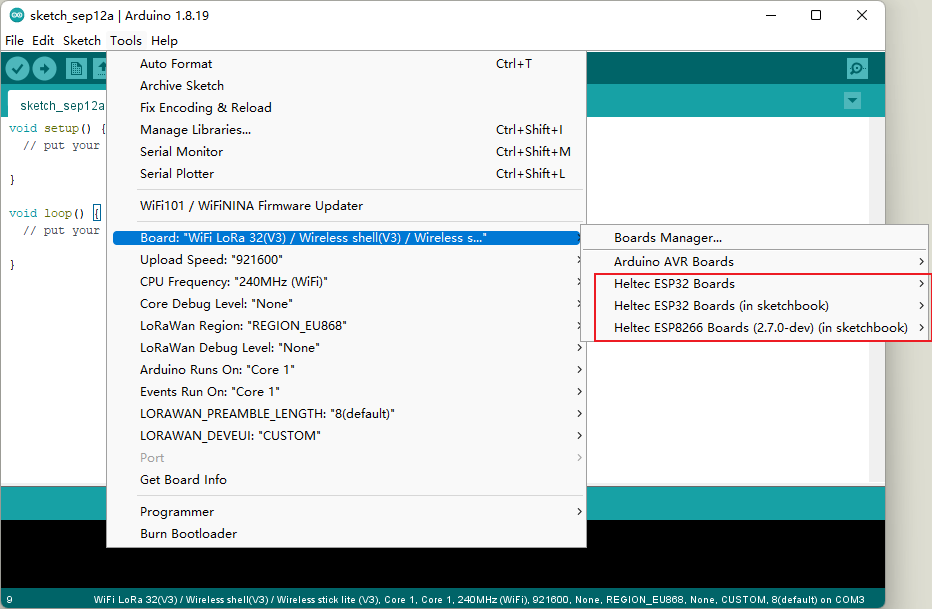

# 2. 运行一个例程

1. 现在，USB电缆连接到WiFi_LoRa_32_V3 LoRa板，然后选择连接到WiFi_LoRa_32_V3 LoRa板的串行端口。
2. 在Arduino IDE中，转到 **Tools**   红色框内选择对应的板子及编译器

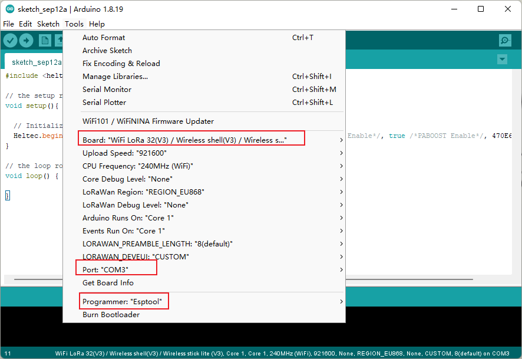

3. 在Arduino IDE中，转到 **File** >  **Examples**  >  **Heltec-Examples**   红色框内的例程

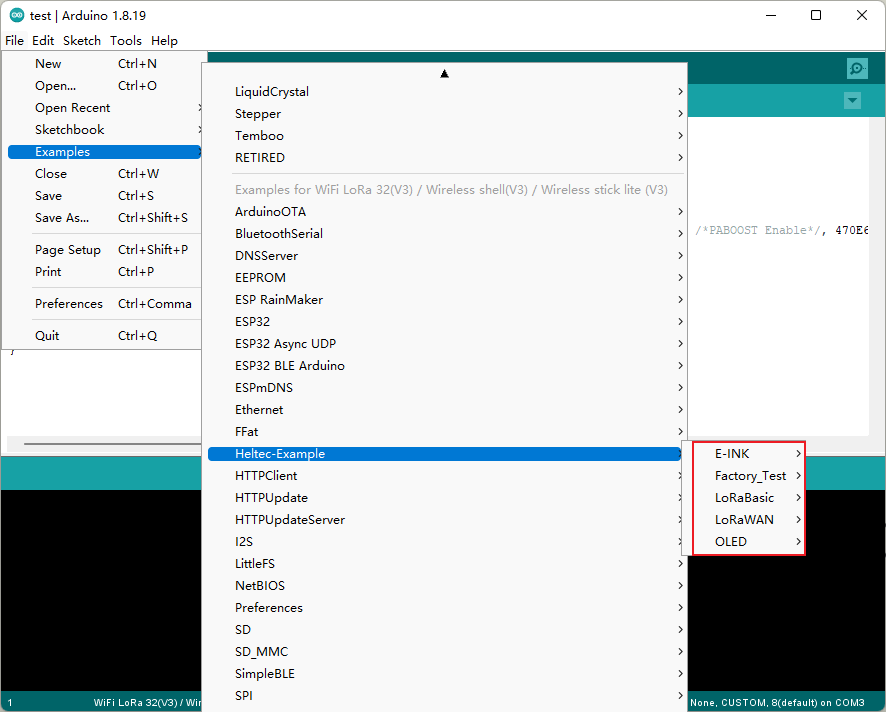

4. 点击编译并上传

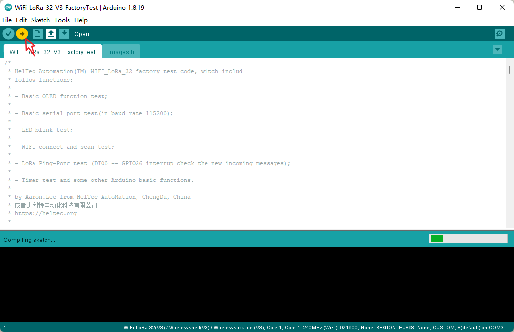

5. 显示烧录成功
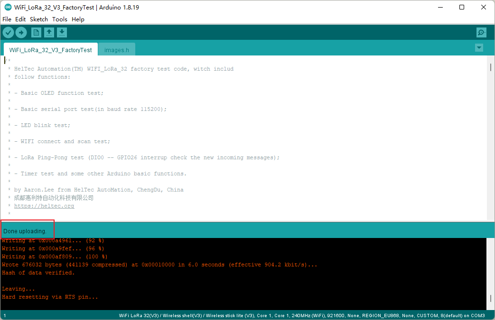

6. 验证烧录成功
* 屏幕会有显示
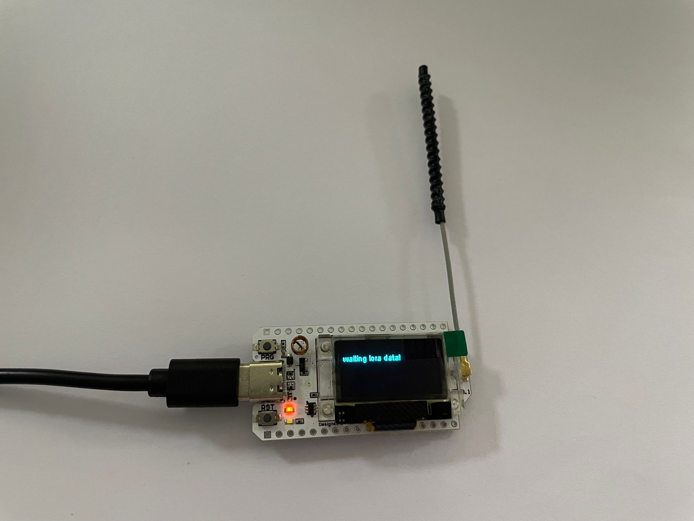
* Arduino的串行监视器会打印一些东西，这意味着WiFi_LoRa_32_V3 LoRa板正在成功运行！   

串口打印一些数据
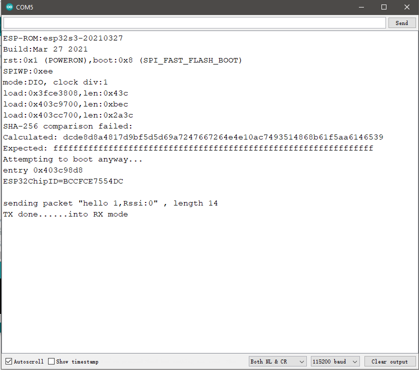

# 3.两个WiFi_LoRa_32_V3 LoRa板测试
如果有两个WiFi_LoRa_32_V3 LoRa板子，同时烧录以上例程，测试Lora数据互传。

1. LCD屏幕显示

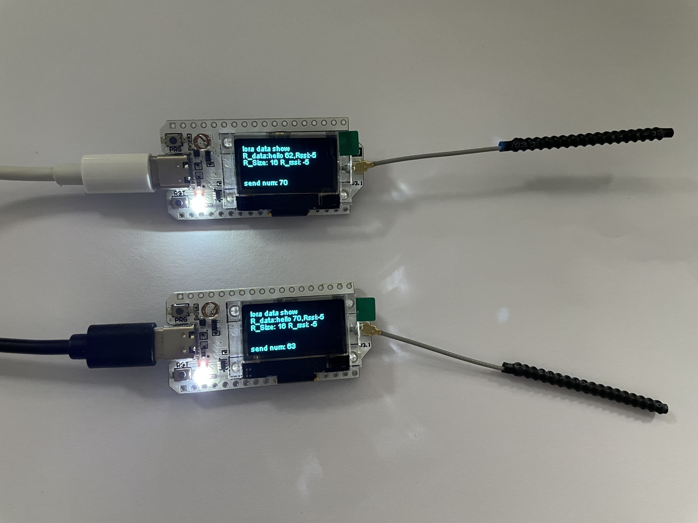

2. 通过Arduino的串行监视器进行数据查看

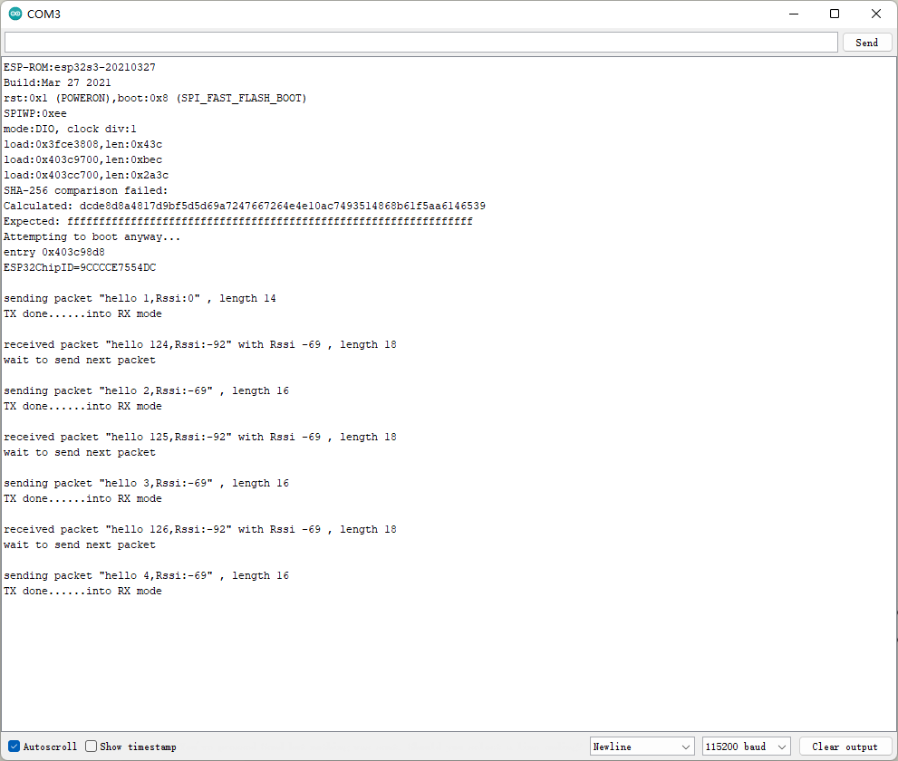

3. LED灯显示
    * Lora未通讯：LED灯红色常亮
    

    * Lora已通讯：LED灯白色常亮
    

# 结束
教程到此结束，如果遇到操作反馈异常的地方，请到评论区进行评论